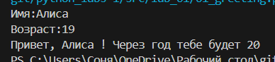
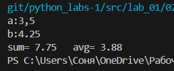
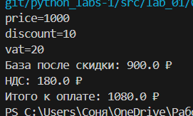
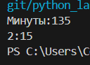
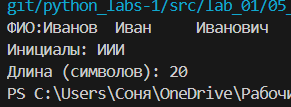
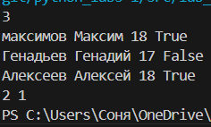
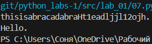

# python_labs
#Лабораторная 1

#Задание 1

```python
name= input('Имя:')
age=int(input('Возраст:'))
print('Привет,',name,'! Через год тебе будет',age+1)
```


#Задание 2

```python
a=float((input('a:')).replace(',','.'))
b=float((input('b:')).replace(',','.'))
print('sum=',round(a+b,2),'  avg=',round((a+b)/2,2))
```


#Задание 3

```python
price=float(input('price='))
discount=float(input('discount='))
vat=float(input('vat='))
base = price * (1 - discount/100)
vat_amount = base * (vat/100)
total = base + vat_amount
print('База после скидки:',round(base,2),'₽')
print('НДС:',round(vat_amount,2),'₽')
print('Итого к оплате:',round(total,2),'₽')
```


#Задание 4

```python
minute=int(input('Минуты:'))
print(f'{minute//60}:{minute%60}')
```


#Задание 5

```python
name=[]
name=[x for x in input('ФИО:').split()]
print(f'Инициалы: {name[0][:1]}{name[1][:1]}{name[2][:1]}')
print('Длина (символов):',len(name[0])+len(name[1])+len(name[2])+2)
```


#Задание 6

```python
n=int(input())
full=0
dist=0
for i in range(n):
    stud=input().split()
    if stud[-1]=='True':
        full+=1
    if stud[-1]=='False':
        dist+=1
print(full,dist)
```


#Задание 7

```python
s=input()
ind=0
for i in s:
    if i not in 'QWERTYUIOPLKJHGFDSAZXCVBNM':
        ind+=1
    else:
        break
s1=s[ind:]
step=0
for i in s1:
    if i not in '0123456789':
        step+=1
    else:
        step+=1
        break
ind=-1
finall=''
for i in s1:
    ind+=1
    if i != '.':
        if ind%step==0:
            finall+=i
    else:
        finall+='.'
        break
print(finall)
```

