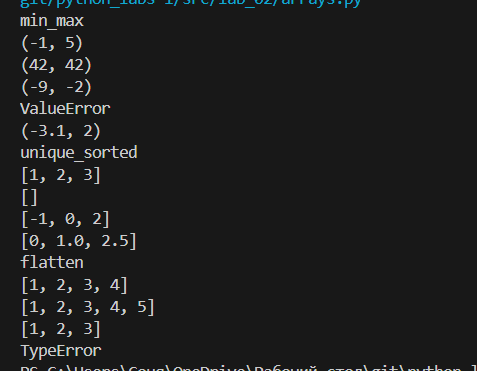
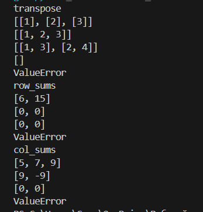
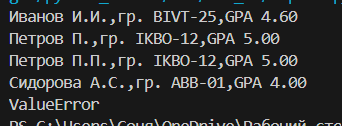
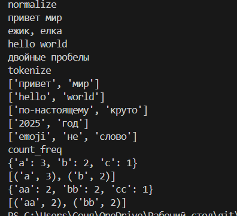
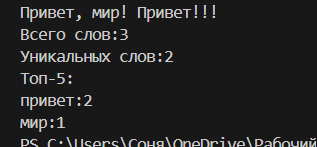

# python_labs
# Лабораторная 1

# Задание 1

```python
name= input('Имя:')
age=int(input('Возраст:'))
print('Привет,',name,'! Через год тебе будет',age+1)
```


# Задание 2

```python
a=float((input('a:')).replace(',','.'))
b=float((input('b:')).replace(',','.'))
print('sum=',round(a+b,2),'  avg=',round((a+b)/2,2))
```


# Задание 3

```python
price=float(input('price='))
discount=float(input('discount='))
vat=float(input('vat='))
base = price * (1 - discount/100)
vat_amount = base * (vat/100)
total = base + vat_amount
print('База после скидки:',round(base,2),'₽')
print('НДС:',round(vat_amount,2),'₽')
print('Итого к оплате:',round(total,2),'₽')
```


# Задание 4

```python
minute=int(input('Минуты:'))
print(f'{minute//60}:{minute%60}')
```


# Задание 5

```python
name=[]
name=[x for x in input('ФИО:').split()]
print(f'Инициалы: {name[0][:1]}{name[1][:1]}{name[2][:1]}')
print('Длина (символов):',len(name[0])+len(name[1])+len(name[2])+2)
```


# Задание 6

```python
n=int(input())
full=0
dist=0
for i in range(n):
    stud=input().split()
    if stud[-1]=='True':
        full+=1
    if stud[-1]=='False':
        dist+=1
print(full,dist)
```


# Задание 7

```python
s=input()
ind=0
for i in s:
    if i not in 'QWERTYUIOPLKJHGFDSAZXCVBNM':
        ind+=1
    else:
        break
s1=s[ind:]
step=0
for i in s1:
    if i not in '0123456789':
        step+=1
    else:
        step+=1
        break
ind=-1
finall=''
for i in s1:
    ind+=1
    if i != '.':
        if ind%step==0:
            finall+=i
    else:
        finall+='.'
        break
print(finall)
```


# Лабораторная 2

# Задание 1

```python
def min_max(nums):
    if len(nums)!=0:
        if all(isinstance(x,(int,float)) for x in nums):
            min_nums=min(nums)
            max_nums=max(nums)
            return tuple([min_nums,max_nums])
    else:
        return 'ValueError'

def unique_sorted(nums):
    if all(isinstance(x,(int,float)) for x in nums):
        return list(sorted(set(nums)))

def flatten(nums):
    if all(isinstance(x,(list,tuple)) for x in nums):
        flatten_nums=[]
        for item in nums:
            flatten_nums.extend(item)
        return flatten_nums
    else:
        return 'TypeError'
```


# Задание 2

```python
def transpose(mat):
    if all(isinstance(item,(float,int)) for num in mat for item in num):
        if len(mat)==0:
            return []
        if len(set(map(len,mat)))!=1:
            return 'ValueError'
        transpose_mat=[]
        for item in range(0,len(mat[0])):
            trans_mat=[]
            for img in mat:
                trans_mat.append(img[item])
            transpose_mat.append(trans_mat)
        return transpose_mat

def row_sums(mat):
    if all(isinstance(item,(float,int)) for num in mat for item in num):
        if len(set(map(len,mat)))!=1:
            return 'ValueError'
        row_sum_mat=[]
        for item in mat:
            row_sum_mat.append(sum(item))
        return row_sum_mat

def col_sums(mat):
    if all(isinstance(item,(float,int)) for num in mat for item in num):
        if len(set(map(len,mat)))!=1:
            return 'ValueError'
        col_sum_mat=[]
        for item in range(0,len(mat[0])):
            s=0
            for img in mat:
                s+=img[item]
            col_sum_mat.append(s)
        return col_sum_mat
```


# Задание 3

```python
def format_record(rec):
    if len(rec)!=3:
        return 'ValueError'
    if len(rec)==3 and type(rec[2]) is not float:
        return 'TypeError'
    name=[]
    name.append(rec[0].split())
    fullinit=''#имя+инициалы
    fullinit=fullinit+name[0][0][0].upper()+name[0][0][1:]+' '+name[0][1][0].upper()+'.'
    if len(name[0])==3:
        fullinit=fullinit+name[0][2][0].upper()+'.'
    group=rec[1]
    gpa=f'{rec[2]:.2f}'
    final=f'{fullinit},гр. {group},GPA {gpa}'
    return final
```


# Лабораторная 3

# Задание 1

```python
def normalize(text: str, *, casefold: bool = True, yo2e: bool = True):
    if casefold:
        text=text.casefold()
    if yo2e:
        text=text.replace('ё','е').replace('Ё','Е')
    if '\t' in text or '\n' in text or '\r' in text:
        text=text.replace('\t',' ').replace('\n',' ').replace('\r',' ')
    text=' '.join(text.split())
    return text

print('normalize')

n='ПрИвЕт\nМИр\t'
print(normalize(n))

n='ёжик, Ёлка'
print(normalize(n))

n='Hello\r\nWorld'
print(normalize(n))

n='  двойные   пробелы  '
print(normalize(n))

import re
def tokenize(text):
    pat=r'[^\w-]'
    text= re.sub(pat,'  ',text)
    return text.split()

print('tokenize')

m="привет мир"
print(tokenize(m))

m="hello,world!!!"
print(tokenize(m))

m="по-настоящему круто"
print(tokenize(m))

m="2025 год"
print(tokenize(m))

m="emoji 😀 не слово"
print(tokenize(m))

def count_freq(tokens: list[str]):
    counts=dict()
    for i in (sorted(set(tokens))):
            counts[i] = tokens.count(i)
    return counts

def top_n(freq: dict[str, int], n: int = 5):
     sorted_freq = sorted(freq.items(), key=lambda x: (-x[1], x[0]))
     return  sorted_freq [:n]

print('count_freq')

x=["a","b","a","c","b","a"]
print(count_freq(x))
print(top_n(count_freq(x),n=2))

x=["bb","aa","bb","aa","cc"]
print(count_freq(x))
print(top_n(count_freq(x),n=2))
```


# Задание 2

```python
import sys
sys.path.append('C:/Users/Соня/OneDrive/Рабочий стол/git/python_labs-1/src/lib')
from text2 import count_freq, top_n, tokenize, normalize

fr=input()
print(f'Всего слов:{len(tokenize(fr))}')
print(f'Уникальных слов:{len(set(tokenize(fr)))}')
print('Топ-5:')
for i in top_n(count_freq(tokenize(normalize(fr)))):
    print(f'{i[0]}:{i[1]}')
```

